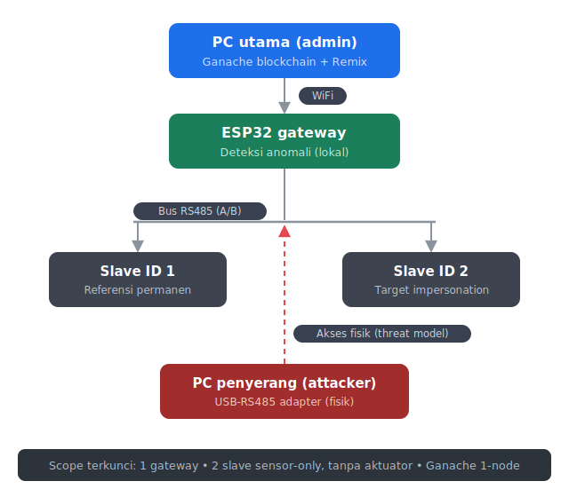
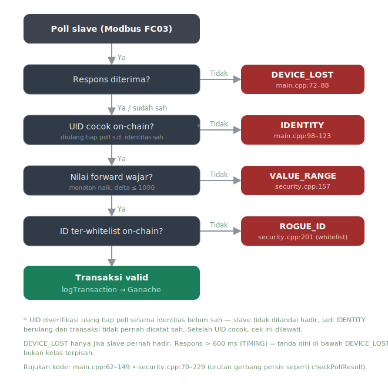

# Panduan Deployment — ESP32 Modbus Security Gateway

> Ikuti bab **A → B → C → D → E → F** secara berurutan dari atas ke bawah.
> Bab **F** kini ada di file terpisah: [PENGOLAHAN_DATA.md](PENGOLAHAN_DATA.md).
> Bab **G** hanya dibuka kalau PC mati / restart.

| Bab | Isi | Kapan dipakai |
|---|---|---|
| [A](#a-persiapan-awal) | Persiapan Awal (Ganache, Remix, config, flash) | Sekali di awal |
| [B](#b-daftarkan-perangkat) | Daftarkan Perangkat (UID → addDevice) | Setelah A |
| [C](#c-monitoring-serial) | Monitoring Serial (rekam ke log) | Setiap sesi uji |
| [D](#d-persiapan-attacker) | Persiapan Attacker | Sebelum pengujian |
| [E](#e-pengujian-per-parameter) | Pengujian per Parameter | Inti pengujian |
| [F — PENGOLAHAN_DATA.md](PENGOLAHAN_DATA.md) | Pengolahan Data → metrik | Setelah pengujian |
| [G](#g-pemulihan-setelah-mati-daya--restart) | Pemulihan setelah mati daya / restart | Hanya saat perlu |

---

## Peta Arsitektur Fisik

Skema fisik proof-of-concept — konsisten dengan definisi terkunci di [LOCKED_DEFINITION.md](LOCKED_DEFINITION.md): 1 ESP32 gateway, 2 slave sensor-only (ID 1 referensi permanen, ID 2 target impersonation), tanpa aktuator, WiFi ke Ganache 1-node, dan PC penyerang lewat adapter USB-RS485.



---

## A. Persiapan Awal

> **Tujuan:** blockchain hidup, kontrak ter-deploy, ESP32 menyala dan tersambung.

### A.1 Jalankan Ganache

1. Buka **Ganache Desktop** (download: https://trufflesuite.com/ganache/ bila belum ada).
2. Klik **New Workspace** → pilih **Ethereum**. **Jangan pilih Quickstart** (chain-nya hilang saat ditutup).
3. Beri nama workspace, lalu klik **Save Workspace**.
4. Pastikan **RPC Server** di port **7545** (`HTTP://127.0.0.1:7545`).
5. Buka **Command Prompt** → ketik `ipconfig` → catat **IPv4 Address** PC kamu (mis. `192.168.0.104`). Ini dipakai di langkah A.3.

> Setelah workspace ini dibuat, **selalu buka workspace yang sama** agar kontrak & data tidak hilang.

### A.2 Deploy Kontrak via Remix

1. Buka https://remix.ethereum.org
2. Di panel kiri **File Explorer**, buat file baru → beri nama `ModbusSecurity.sol` → copy seluruh isi `contracts/ModbusSecurity.sol` dari repo ke situ.
3. Klik ikon **Solidity Compiler** (kiri) → pilih versi compiler **0.8.x**.
4. Klik **Advanced Configurations** → ubah **EVM Version** menjadi **`paris`**.
   > ⚠️ Wajib `paris`. Ganache tidak mendukung opcode `PUSH0` dari versi Shanghai ke atas — kalau tidak diubah, kontrak gagal jalan.
5. Klik tombol **Compile ModbusSecurity.sol**. Pastikan muncul centang hijau.
6. Klik ikon **Deploy & Run Transactions** (kiri).
7. Pada **Environment**, pilih **Custom - External Http Provider** → isi URL `http://127.0.0.1:7545` → OK.
8. Klik tombol **Deploy** (oranye).
9. Di panel **Deployed Contracts** (bawah), klik ikon **copy** di sebelah nama kontrak → ini **CONTRACT_ADDRESS** baru. Simpan.

### A.3 Isi `src/config.h`

Buka `src/config.h`, isi empat baris ini:

| Field | Cara mendapatkan |
|---|---|
| `BLOCKCHAIN_RPC_URL` | `http://<IPv4 dari A.1>:7545` |
| `CONTRACT_ADDRESS` | Alamat dari A.2 langkah 9 |
| `SENDER_PRIVATE_KEY` | Ganache → tab **Accounts** → klik ikon **kunci** akun pertama → copy private key **tanpa `0x`** |
| `SENDER_ADDRESS` | Ganache → tab **Accounts** → alamat akun baris pertama |

```cpp
#define BLOCKCHAIN_RPC_URL   "http://192.168.0.104:7545"
#define CONTRACT_ADDRESS     "0x3eC770D542c28cf75daf4882ea1D97ddb6937660"
#define SENDER_PRIVATE_KEY   "<dari Ganache, tanpa 0x>"
#define SENDER_ADDRESS       "<dari Ganache>"
```

Simpan file (`Ctrl + S`).

### A.4 Build & Flash ESP32

1. Sambungkan ESP32 ke PC via USB.
2. Buka terminal di VS Code (shortcut: **Ctrl + `** backtick).
3. Jalankan:
   ```powershell
   %USERPROFILE%\.platformio\penv\Scripts\pio run -e esp32dev --target upload
   ```
4. Tunggu sampai muncul `SUCCESS`. ESP32 sekarang menjalankan firmware terbaru.

> ⚠️ Setiap kali `config.h` berubah, **wajib flash ulang** — kalau tidak, ESP32 masih memakai konfigurasi lama.

**✅ Selesai jika:** Ganache jalan di port 7545, kontrak ter-deploy (punya `CONTRACT_ADDRESS`), `config.h` terisi 4 field, dan flash ESP32 menampilkan `SUCCESS`.

---

## B. Daftarkan Perangkat

> **Tujuan:** tiap slave sah (ID 1 dan ID 2) terdaftar di kontrak dengan UID-nya, agar tidak dianggap anomali.

> ⚠️ `addDevice(uint8 slaveId, uint256 uid)` butuh **DUA argumen**. Memanggil dengan satu argumen akan **ditolak Remix**.

> ⚠️ Pastikan alamat Modbus fisik pada sensor AGNIKA kedua benar-benar diset ke ID 2 di hardware (dip switch/rotary switch), bukan hanya di `config.h`.

### B.1 Baca UID dari serial

1. Buka serial monitor (lihat Bab C bila belum jalan).
2. Saat ESP32 mem-poll slave pertama kali, muncul baris seperti:
   ```
   [SEC] Slave 1 UID = 0x0000000000000000000000AB
   [SEC] Slave 2 UID = 0x33310c4737353230003f0049
   ```
3. Copy nilai `0x...` (24 karakter hex) untuk tiap slave.

### B.2 Daftarkan di Remix

1. Di Remix → panel **Deployed Contracts** → cari fungsi **`addDevice`**.
2. Klik tanda **˅** untuk membuka dua kolom input.
3. Isi:
   - kolom **slaveId** = `1`
   - kolom **uid** = `0x0000000000000000000000AB` (UID slave 1 dari B.1)
4. Klik **transact**. Ulangi untuk slave 2:
   ```
   addDevice(2, 0x33310c4737353230003f0049)
   ```

> ℹ️ **Rekonsiliasi alur ID 2 (Bagian B vs pengujian ROGUE_ID/VALUE_RANGE di Bab E) — DIPUTUSKAN:** ID 2 di atas didaftarkan **permanen** sebagai slave fisik sah kedua. Pengujian ROGUE_ID (E.1) nanti mencabutnya (`removeDevice(2)`) untuk menguji ROGUE_ID, lalu pengujian VALUE_RANGE (E.2) memanggil `addDevice(2, ...)` lagi. Langkah `addDevice(2, ...)` di E.2 **tetap dipertahankan** (bukan dihapus) karena `addDevice()` di kontrak bersifat idempotent — aman dipanggil ulang tanpa efek samping (lihat `contracts/ModbusSecurity.sol:53-57`) — sehingga langkah ini selalu benar baik E.1 dijalankan lebih dulu di sesi yang sama maupun E.2 dijalankan sebagai sesi independen.

### B.3 Verifikasi pendaftaran

1. Di Remix, klik fungsi **`whitelist`** → isi `1` → **call** → harus `true`.
2. Klik **`verifyDevice`** (versi `uint8`) → isi `1` → **call** → harus `0:bool: true`.
3. Di serial ESP32, muncul:
   ```
   [BC] verifyDevice(1, UID) → OK
   [SEC] identitas slave 1 terverifikasi (UID cocok)
   ```

> Slave yang **belum** didaftarkan akan memicu anomali `IDENTITY` (jenis 5) **berulang tiap poll** (slave tidak ditandai hadir selama UID belum cocok), disertai `ROGUE_ID` dari pengecekan whitelist tiap poll. Itu memang perilaku yang benar.

**✅ Selesai jika:** `whitelist(1)` dan `whitelist(2)` mengembalikan `true`, dan serial menampilkan `[SEC] identitas slave N terverifikasi (UID cocok)` untuk kedua slave.

---

## C. Monitoring Serial

> **Tujuan:** merekam semua output ESP32 ke file `.log` otomatis, tanpa perlu menatap layar.

1. Pastikan `platformio.ini` punya baris `monitor_filters = log2file` (sudah ada di repo).
2. Jalankan monitor:
   ```powershell
   %USERPROFILE%\.platformio\penv\Scripts\pio device monitor -e esp32dev
   ```
3. Seluruh output **otomatis tersimpan** ke `.pio/build/esp32dev/monitor-<tanggal>.log`.
4. Tanda koneksi sehat di serial:
   - `[BC] BlockchainClient siap, RPC: http://...`
   - `[BC] verifyDevice(N, UID) → OK`
   - `[SEC] identitas slave N terverifikasi (UID cocok)`

> Kalau muncul `[BC] NODE BLOCKCHAIN TIDAK TERJANGKAU`: cek IP Ganache di `config.h`, pastikan Ganache jalan di port 7545, dan firewall tidak memblokir.

> 💡 Untuk tiap parameter di Bab E, **catat nama file `.log`** yang aktif saat itu — file ini yang akan di-parse di [PENGOLAHAN_DATA.md](PENGOLAHAN_DATA.md) (Bab F).

**✅ Selesai jika:** serial monitor jalan, muncul `[BC] BlockchainClient siap`, dan file `.log` mulai terisi otomatis.

---

## D. Persiapan Attacker

> **Tujuan:** siapkan PC attacker sekali sebelum pengujian per parameter di Bab E dimulai.

1. Install pyserial di PC attacker:
   ```powershell
   pip install pyserial
   ```
2. Cek COM port USB-RS485 di Device Manager (mis. `COM7`). Jangan tertukar dengan port ESP32.

**✅ Selesai jika:** `pip install pyserial` sukses dan COM port adapter USB-RS485 attacker sudah diketahui.

---

## E. Pengujian per Parameter

> **Tujuan:** membangkitkan tiap parameter deteksi secara terkendali, satu parameter satu sesi.

Urutan gerbang deteksi di firmware — persis seperti `pollAndCheck()` (`main.cpp`) lalu `checkPollResult()` (`security.cpp`):



Kriteria pengujian dinyatakan sebagai **jumlah sampel (n)**, bukan durasi waktu:

| Parameter | Kriteria pengujian (n) | Kode file log |
|---|---|---|
| ROGUE_ID | Polling kontinu otomatis — n besar, **tidak perlu target eksplisit** (n mengikuti durasi proses berjalan) | A |
| VALUE_RANGE | Polling kontinu otomatis — n besar, **tidak perlu target eksplisit** | B |
| DEVICE_LOST | **WAJIB eksplisit n ≥ 10 siklus** (cabut-pasang kabel berulang) — hanya terpicu saat transisi status, bukan tiap poll | C |
| Peniruan Sempurna (NONE, FN by design) | Prosedural — attacker meniru UID asli sekali, amati tidak ada anomali | D |
| Operasi Normal (NONE, ukur FPR) | Durasi minimal 30 menit (atau N siklus polling), tanpa attacker | E |
| IDENTITY | Polling kontinu otomatis — n besar, **tidak perlu target eksplisit** (UID diverifikasi ulang tiap poll selama belum cocok) | SUB |
| Tamper-Evidence | **n = 1 record** — prosedural (edit-and-compare), bukan berbasis n/durasi | — |

> Kolom "Kode file log" (A/B/C/D/E/SUB) dipakai HANYA sebagai id file `.log` dan argumen `--scenario` di [PENGOLAHAN_DATA.md](PENGOLAHAN_DATA.md) — bukan nomor bagian.

### E.1 ROGUE_ID

> **Tujuan:** buktikan slave dengan ID di luar whitelist blockchain terdeteksi.

| Aspek | Isi |
|---|---|
| Perintah attacker | Prasyarat di Remix: `removeDevice(2)` → `transact`, verifikasi `whitelist(2)` = `false`. Lalu di PC attacker:<br>`python tools/attacker/attacker_slave.py --port <COM_ATTACKER> --id 2 --mode normal --base 1000`<br>Biarkan kontinu — n mengikuti durasi, tak perlu target eksplisit. |
| Output diharapkan | `[SEC] >>> ANOMALI ... jenis=ROGUE_ID` |
| File log | `A` |
| Rujukan kode | `security.cpp` (checkWhitelist), `main.cpp` |

### E.2 VALUE_RANGE

> **Tujuan:** buktikan nilai forward tidak plausibel (turun) terdeteksi.

| Aspek | Isi |
|---|---|
| Perintah attacker | Prasyarat: `addDevice(2, <UID slave 2 dari serial>)` agar lolos identitas (idempotent — lihat B.2). Lalu:<br>`python tools/attacker/attacker_slave.py --port <COM_ATTACKER> --id 2 --mode drop --base 1000`<br>Biarkan kontinu — n mengikuti durasi. |
| Output diharapkan | `[SEC] >>> ANOMALI ... jenis=VALUE_RANGE` (forward pulse turun) |
| File log | `B` |
| Rujukan kode | `security.cpp` (checkValueRange), `main.cpp` |

### E.3 DEVICE_LOST

> **Tujuan:** buktikan slave yang pernah hadir lalu hilang terdeteksi.

| Aspek | Isi |
|---|---|
| Perintah attacker | Aksi fisik, **WAJIB n ≥ 10 siklus**. Prasyarat: slave 1 sudah pernah merespons (`wasPresent`). Ulangi ≥ 10 kali: (1) cabut kabel RS485 pada slave 1 / matikan slave-nya → tunggu anomali (1 sampel); (2) colok kembali → tunggu slave pulih. |
| Output diharapkan | `[SEC] >>> ANOMALI ... jenis=DEVICE_LOST` |
| File log | `C` |
| Rujukan kode | `main.cpp` (cek `wasPresent`), `security.cpp` (markLost) |

### E.4 Peniruan Sempurna (NONE, FN by design)

> **Tujuan:** tunjukkan batas sistem — attacker meniru UID asli TIDAK terdeteksi (False Negative by design).

| Aspek | Isi |
|---|---|
| Perintah attacker | Prasyarat: slave 2 terdaftar dengan UID asli. Lalu:<br>`python tools/attacker/attacker_slave.py --port <COM_ATTACKER> --id 2 --mode normal --base 1000 --uid 0x<UID asli slave 2>` |
| Output diharapkan | **TIDAK ada** anomali — attacker berhasil menyamar (FN by design → autentikasi kripto = future work) |
| File log | `D` |
| Rujukan kode | `main.cpp` (verifyDevice id+uid) |

### E.5 Operasi Normal (NONE, ukur FPR)

> **Tujuan:** ukur False Positive Rate saat operasi normal tanpa attacker.

| Aspek | Isi |
|---|---|
| Perintah attacker | **Tidak ada attacker.** Pastikan slave 1 dan 2 terhubung + terdaftar; biarkan sistem berjalan normal minimal **30 menit** (atau N siklus polling). |
| Output diharapkan | **TIDAK ada** baris `[SEC] >>> ANOMALI`. Bila muncul → **False Positive**. |
| File log | `E` |
| Rujukan kode | `security.cpp` (checkPollResult) |

### E.6 IDENTITY

> **Tujuan:** buktikan substitusi identitas (UID salah) terdeteksi berulang tiap poll dan transaksinya diblokir.

| Aspek | Isi |
|---|---|
| Perintah attacker | Prasyarat: slave 2 terdaftar dengan UID asli. Lalu:<br>`python tools/attacker/attacker_slave.py --port <COM_ATTACKER> --id 2 --mode normal --base 1000` (tanpa `--uid`, UID default nol)<br>Biarkan kontinu — n mengikuti durasi, tak perlu target eksplisit. |
| Output diharapkan | `[SEC] >>> ANOMALI ... jenis=IDENTITY` (UID tidak cocok), **berulang tiap poll** — selama UID belum cocok slave tidak ditandai hadir, sehingga transaksi tidak pernah dicatat sebagai sah |
| File log | `SUB` |
| Rujukan kode | `main.cpp` (verifyDevice id+uid), `blockchain_client.cpp` |

### E.7 Tamper-Evidence

> **Tujuan:** buktikan perubahan record dapat dideteksi (hash tidak cocok). n = 1 record, prosedural.

| Aspek | Isi |
|---|---|
| Perintah attacker | Prosedur manual edit-and-compare (n = 1) — lihat 6 langkah di bawah. |
| Output diharapkan | Hash baru **TIDAK SAMA** dengan `txHash` on-chain → perubahan data terdeteksi (tamper-evident) |
| File log | — (n = 1, tidak diparse `parse_serial.py`) |
| Rujukan kode | `hash_util.cpp` (SHA-256), `blockchain_client.cpp` (logTransaction/logAnomaly), `contracts/ModbusSecurity.sol` |

Langkah prosedur (n = 1):

1. Picu satu record tercatat ke blockchain: biarkan satu transaksi valid ter-flush secara normal (lihat Bab F), atau picu satu anomali (mis. ROGUE_ID di E.1).
2. Ambil txHash on-chain record tsb dari `receipt.logs` — pakai `tools/diagnostics/check_tx_status.mjs` (lihat [PENGOLAHAN_DATA.md](PENGOLAHAN_DATA.md)) atau Remix — lalu salin payload aslinya (txData/txHash, atau slaveId/anomalyType/detail) ke file JSON baru, mis. `tools/diagnostics/tamper_test_record.json`.
3. **Edit** file JSON tsb — ubah satu karakter pada field data (misal satu digit pada `txData` atau `detail`).
4. **Hash ulang** data yang sudah diedit itu dengan SHA-256 untuk mendapatkan hash baru.
5. **Bandingkan** hash baru terhadap `txHash` asli yang tersimpan di `receipt.logs` on-chain (event `TransactionLogged`/`AnomalyLogged`) — hasil yang benar harus **TIDAK SAMA**.
6. **Catat** hasil perbandingan (cocok/tidak cocok) sebagai bukti tamper-evidence untuk Bab IV — ketidakcocokan hash membuktikan bahwa perubahan data dapat dideteksi secara kriptografis, sesuai prinsip "blockchain hanya mencatat, ESP32 yang mendeteksi" di [LOCKED_DEFINITION.md](LOCKED_DEFINITION.md).

---

## F. Pengolahan Data

Bab ini ada di file terpisah: **[PENGOLAHAN_DATA.md](PENGOLAHAN_DATA.md)**.

Jalankan setelah seluruh parameter di Bab E selesai diuji dan tiap file `.log` sudah dicatat.

---

## G. Pemulihan Setelah Mati Daya / Restart

Buka bab ini **hanya** kalau PC mati atau restart. Tidak perlu deploy ulang maupun `addDevice` ulang.

| Komponen | Langkah | Hasil |
|---|---|---|
| **Ganache** | Buka workspace tersimpan yang sama | Chain, kontrak, whitelist kembali — `CONTRACT_ADDRESS` tetap |
| **Remix** | Compile sol (EVM `paris`) → Deployed Contracts → **+ Add Contract** + tempel `CONTRACT_ADDRESS` | State (whitelist + UID) muncul kembali tanpa Deploy |
| **ESP32** | Nyalakan (tidak perlu apa-apa) | Auto re-baseline; UID diverifikasi ulang saat kontak pertama |

**Langkah Remix detail:**
1. Buka Remix → tab **Solidity Compiler** → set EVM `paris` → **Compile** (tombol At Address baru muncul setelah compile).
2. Tab **Deploy & Run** → Environment **Custom - External Http Provider** → `http://127.0.0.1:7545`.
3. Panel **Deployed Contracts** → klik **+ Add Contract** → tempel `CONTRACT_ADDRESS` lama → konfirmasi.
4. **Jangan klik Deploy** (oranye) — itu membuat kontrak baru dengan state kosong.

| Kondisi | Yang perlu dilakukan |
|---|---|
| IP PC tidak berubah | Langsung Add Contract, selesai |
| IP PC berubah | Update `BLOCKCHAIN_RPC_URL` di `config.h` → flash ulang |

> Sensor AGNIKA menyimpan totalizer di memori non-volatile — nilai forward/backward/accumulative **lanjut dari posisi terakhir**, bukan dari nol.

**Ringkas:** buka workspace Ganache → Compile + Add Contract di Remix → nyalakan ESP32. Selesai.

---

## Lampiran: Referensi

### Data yang ditangkap per slave

| Data | Sumber register | Peran |
|---|---|---|
| `id` | Modbus slave address (1–5) | **Identitas** — dicocokkan ke whitelist on-chain |
| `uid` | 6 register @`0x000D` (96-bit, big-endian) | **Identitas** — dicocokkan ke `deviceUID` on-chain |
| `forward` | uint32 @`0x0000`–`0x0001` (LSW dulu) | **Integritas nilai** — totalizer, wajib monoton naik |
| `backward` | uint32 @`0x0002`–`0x0003` (LSW dulu) | Data proses pendukung (turut tercatat) |
| `accumulative` | dihitung: `forward − backward` | Data proses pendukung (turut tercatat) |

Deteksi keamanan berfokus pada **identitas** (`id` + `uid`) dan **integritas nilai** (`forward` monoton). `backward` dan `accumulative` bukan dasar penolakan — hanya direkam sebagai data pendukung.

### Opsi attacker

| Opsi | Arti |
|---|---|
| `--port` | COM port RS485 attacker |
| `--id` | ID slave yang dipalsukan |
| `--mode normal` | Forward pulse monoton naik → lolos deteksi nilai |
| `--mode drop` | Forward pulse turun → memicu `VALUE_RANGE` |
| `--mode jump` | Lonjakan pulse besar → memicu `VALUE_RANGE` |
| `--base` | Nilai forward pulse awal |
| `--uid 0x<UID>` | Jawab register UID `0x000D` dengan UID tertentu (uji evasif) |

### Jenis anomali

4 kelas final (lihat [LOCKED_DEFINITION.md](LOCKED_DEFINITION.md) untuk definisi terkunci):

| Tipe | Nama | Pemicu |
|---|---|---|
| 1 | ROGUE_ID | ID tidak ada di whitelist blockchain |
| 3 | VALUE_RANGE | Forward pulse turun atau delta > 1000 |
| 4 | DEVICE_LOST | Slave pernah hadir, kini tidak merespons (termasuk mekanisme TIMING — respons > window 600 ms — sebagai tanda awal sebelum device dianggap hilang) |
| 5 | IDENTITY | UID tidak cocok atau belum terdaftar on-chain |

> Definisi sistem yang terkunci ada di [LOCKED_DEFINITION.md](LOCKED_DEFINITION.md).
